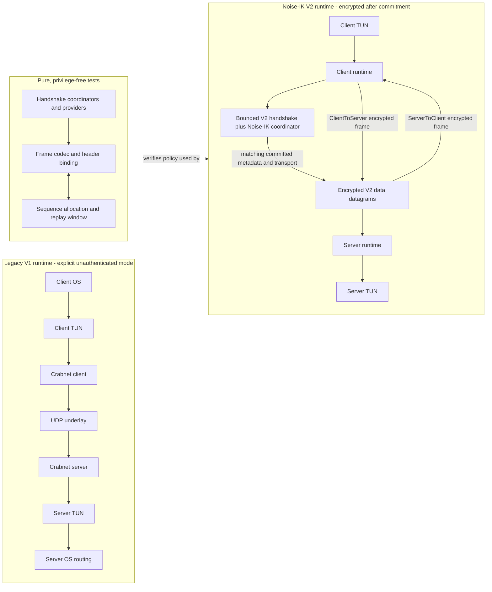
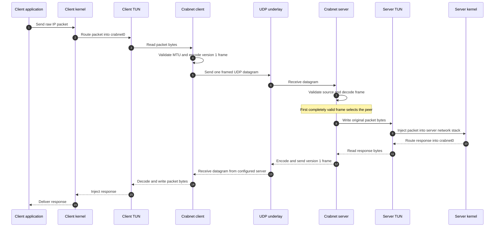
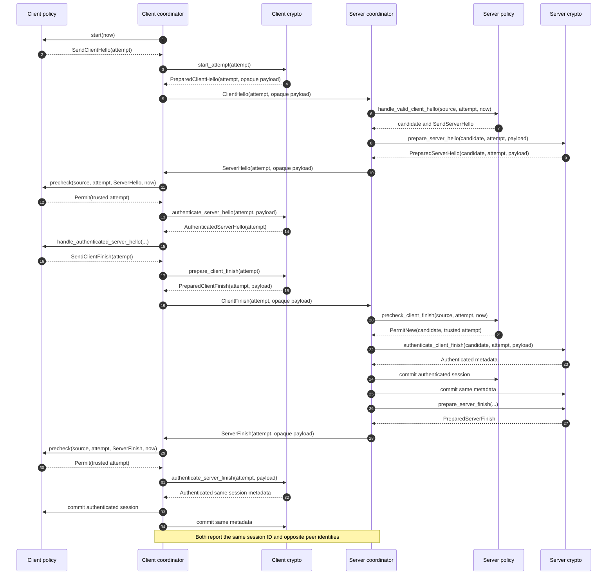
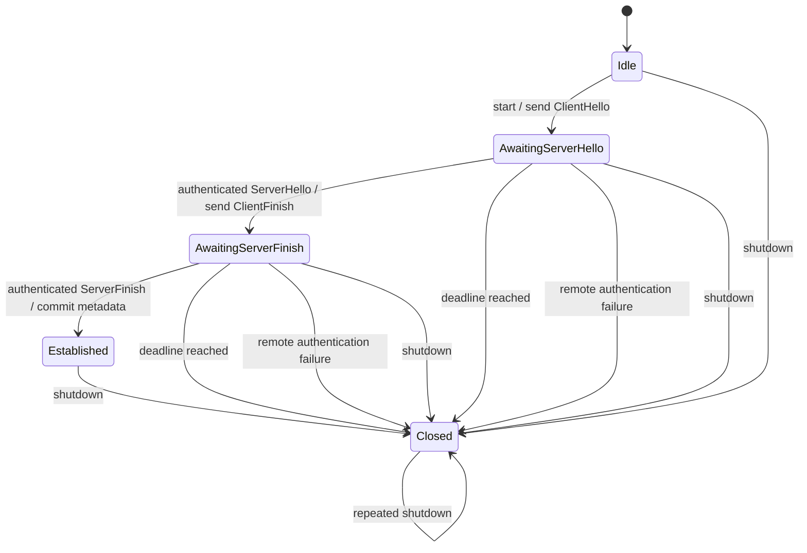
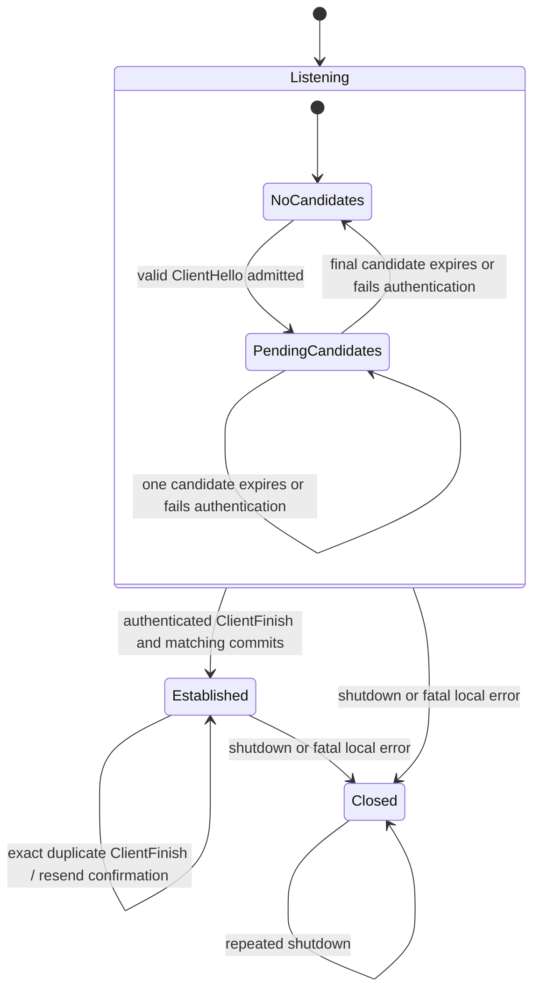
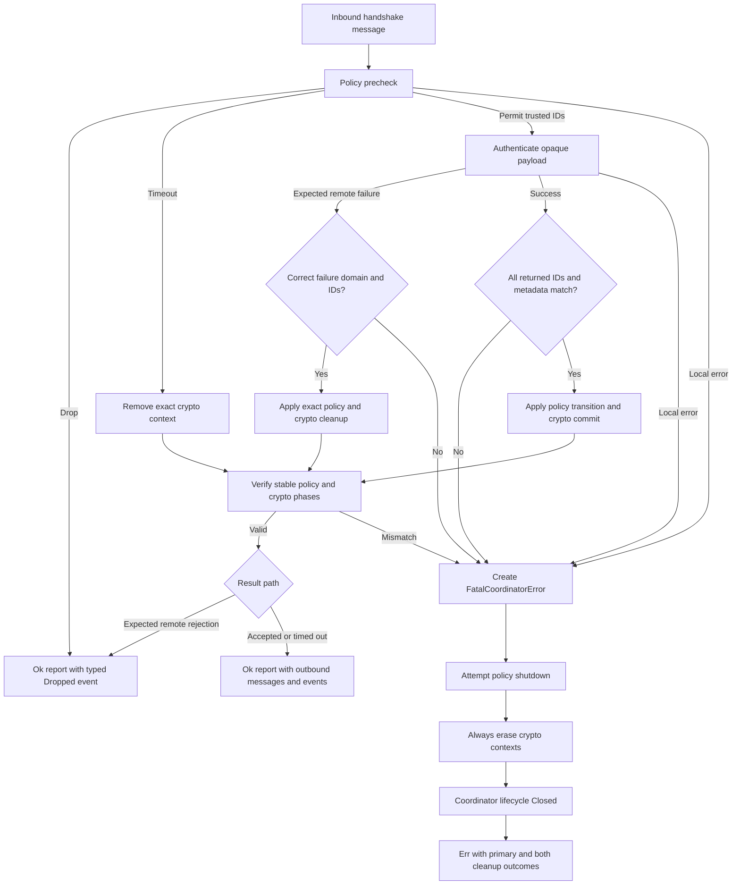
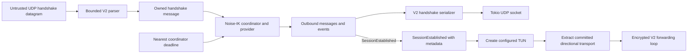
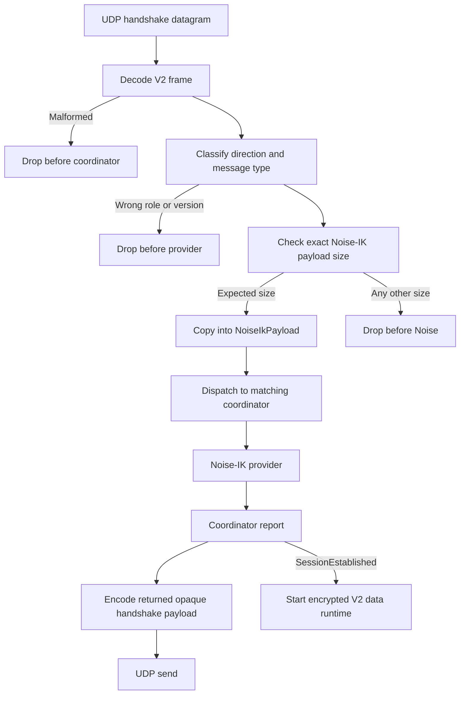
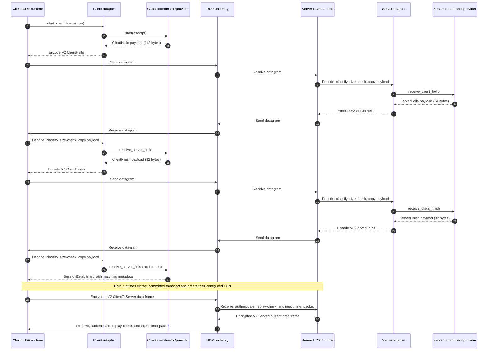
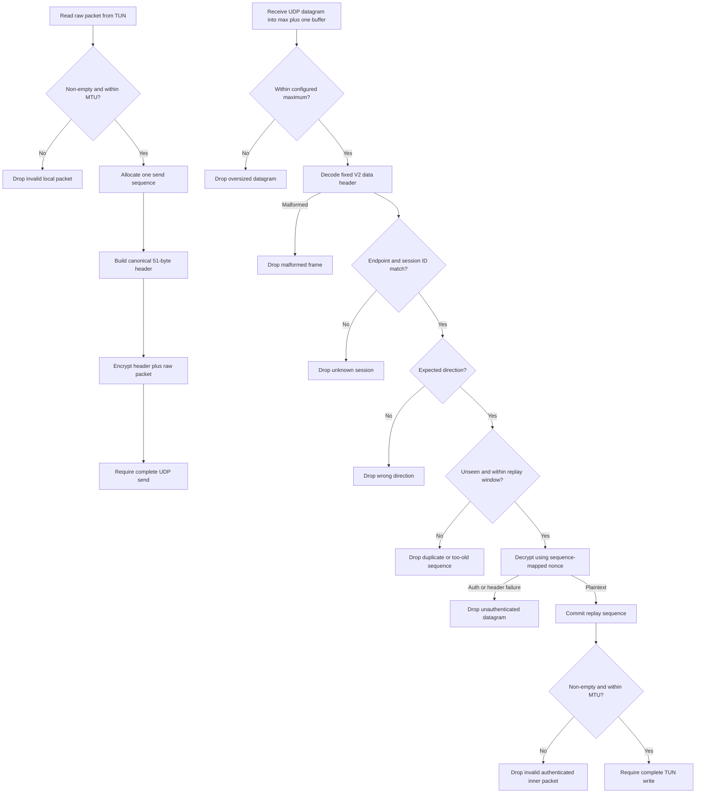

# Current service diagrams

These diagrams visualize Crabnet as it exists now. Mermaid diagrams render directly on GitHub and
remain reviewable as text.

The most important boundary is repeated throughout this page:

- version 1 packet forwarding remains an explicit unauthenticated runtime mode; and
- Noise-IK commits the V2 handshake before it creates a TUN and forwards encrypted data frames. It never falls back to V1 plaintext.

## 1. System context and implementation status

Noise-IK selects the encrypted path only after both coordinators commit matching session metadata.
Malformed, unknown-session, wrong-direction, authentication-failed, and replayed datagrams are
dropped; local I/O, crypto, or invariant failures stop the session.

## 2. Active version 1 packet flow

This flow is framed but unauthenticated and unencrypted. A malformed first datagram cannot select
the peer, but any sender that can produce a valid version 1 data frame can.

## 3. Pure four-message handshake

Every arrow here is a synchronous Rust call or movement of an owned Rust value in a test. It does
not represent UDP bytes yet.

## 4. Client stable states

Wrong source, stale attempt, or unexpected message produces a drop without advancing a valid
attempt. A local policy, crypto, or invariant error takes the fail-closed path instead.

## 5. Server candidate and session lifecycle

The server can own several pending candidates in the pure subsystem, but only one session can be
established. Candidate identity is the tuple of source ownership, server-assigned `CandidateId`,
and client attempt ID.

## 6. Inbound decision and fail-closed behavior

Remote authentication failure is ordinary hostile input when its domain and IDs are valid. A
provider returning the wrong failure variant or wrong correlation is a local contract violation and
therefore fatal.

## 7. V2 Noise-IK handshake-to-data runtime

The adapter keeps parsing, socket I/O, timers, and cancellation outside the pure coordinator. It does
not hold a coordinator borrow across `.await`. The runtime creates a TUN and enters encrypted
forwarding only after it extracts a transport whose committed metadata exactly matches the event.

## 8. V2 handshake framing validation and dispatch

The adapter rejects malformed, misdirected, and incorrectly sized frames before mutating provider state.
It owns the borrowed-to-owned payload boundary; the provider receives only `NoiseIkPayload`.

## 9. V2 Noise-IK message exchange

## 10. Encrypted V2 data-frame decisions

Only the local I/O, frame-construction, transport-provider, replay-invariant, and partial-write
failures are fatal. Every malformed or hostile remote datagram is dropped and cannot replace
the committed single-peer session.
