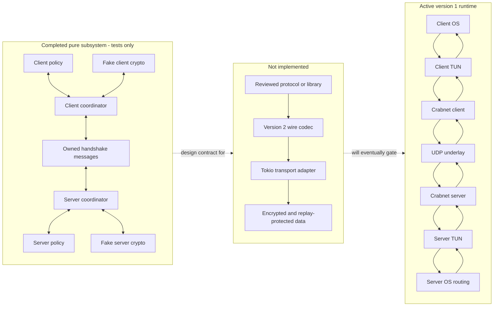
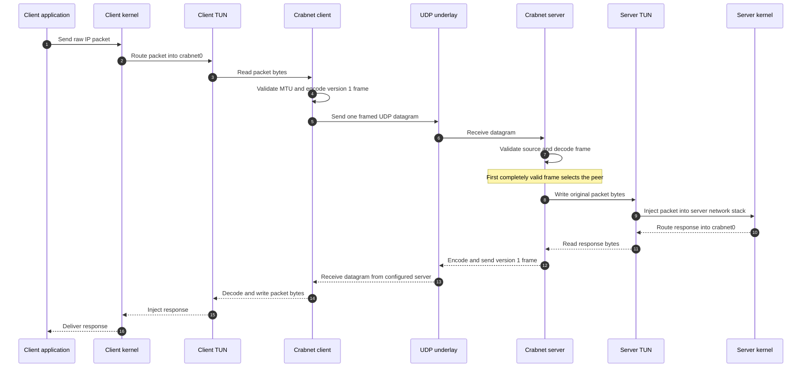
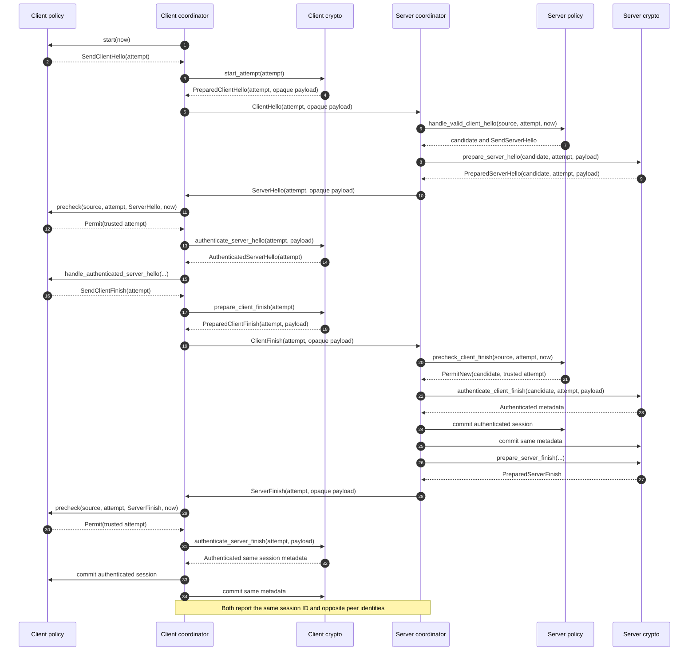
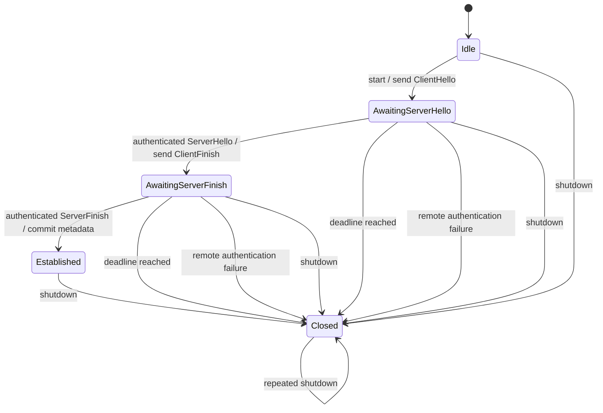
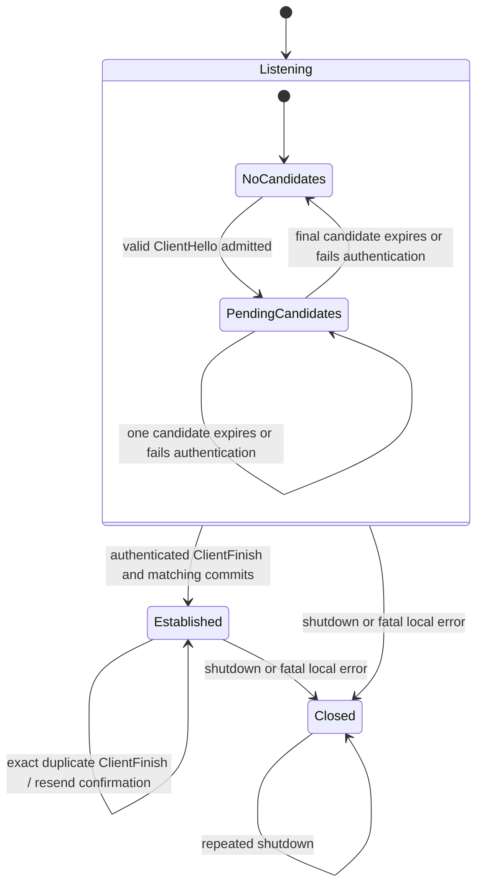
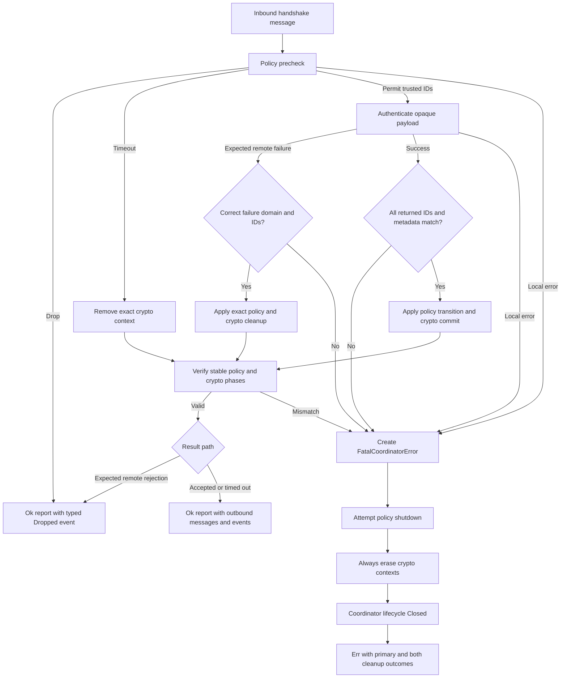
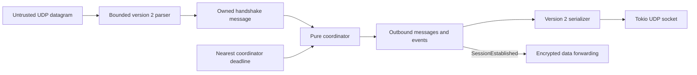

# Current service diagrams

These diagrams visualize Crabnet as it exists now. Mermaid diagrams render directly on GitHub and
remain reviewable as text.

The most important boundary is repeated throughout this page:

- version 1 packet forwarding is active in the executable; and
- the Milestone 2.3 handshake is complete only as a pure in-memory subsystem.

## 1. System context and implementation status

The dashed arrows are roadmap boundaries, not current calls. The executable does not construct or
drive either handshake coordinator.

## 2. Active version 1 packet flow

This flow is framed but unauthenticated and unencrypted. A malformed first datagram cannot select
the peer, but any sender that can produce a valid version 1 data frame can.

## 3. Pure four-message handshake

Every arrow here is a synchronous Rust call or movement of an owned Rust value in a test. It does
not represent UDP bytes yet.

## 4. Client stable states

Wrong source, stale attempt, or unexpected message produces a drop without advancing a valid
attempt. A local policy, crypto, or invariant error takes the fail-closed path instead.

## 5. Server candidate and session lifecycle

The server can own several pending candidates in the pure subsystem, but only one session can be
established. Candidate identity is the tuple of source ownership, server-assigned `CandidateId`,
and client attempt ID.

## 6. Inbound decision and fail-closed behavior

Remote authentication failure is ordinary hostile input when its domain and IDs are valid. A
provider returning the wrong failure variant or wrong correlation is a local contract violation and
therefore fatal.

## 7. Planned integration boundary

The adapter must keep parsing, socket I/O, timers, and cancellation outside the pure coordinator.
It must not hold a coordinator borrow across `.await`, and forwarding must remain disabled until a
real provider establishes authenticated session state.
