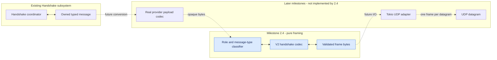
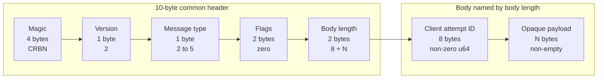
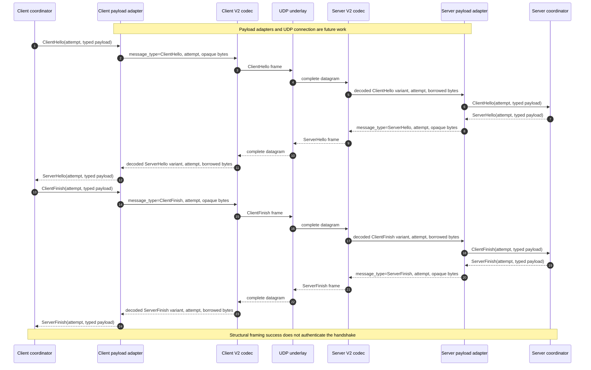
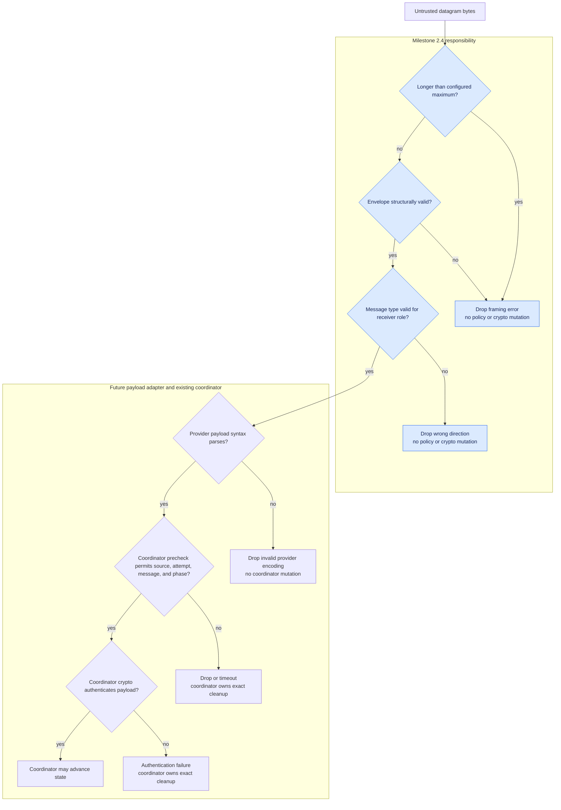
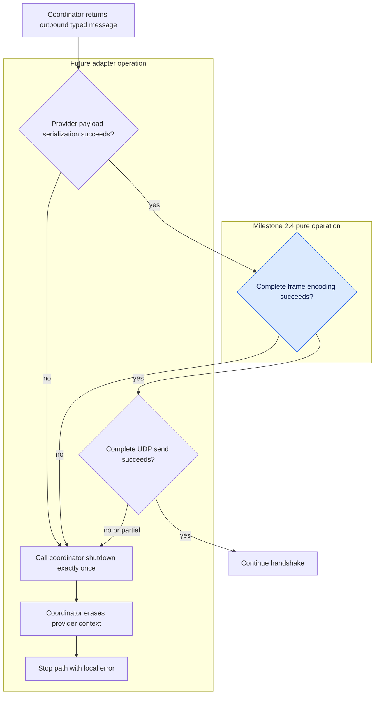
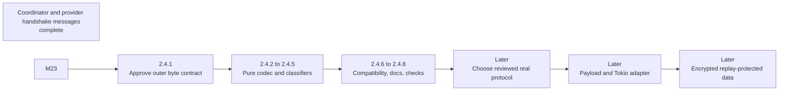

# Handshake framing design

Milestone tracked: **2.4**

Status: **implemented; codec, adapter, and handshake-only runtime integrated**

This document is the implementation contract and progress checklist for Milestone 2.4. It defines
a bounded, transport-facing byte envelope for the four handshake messages completed in Milestone
This handshake layer. The codec remains pure; the provider adapter and Noise-IK handshake-only runtime connect it to
UDP. This document still does not define an encrypted data frame.

The framing code must be deterministic, synchronous, allocation-free while decoding, and testable
without Tokio, sockets, TUN devices, root, or network namespaces.

## Scope and safety boundary

Milestone 2.4 proves that Crabnet can safely classify and bound untrusted handshake bytes before
they reach session policy or a crypto provider. It does not make those bytes authentic or secret.

In scope:

- exact outer layouts for `ClientHello`, `ServerHello`, `ClientFinish`, and `ServerFinish`;
- stable version and message-type values;
- exact length, integer, byte-order, and size rules;
- borrowed decoding and caller-owned encoding buffers;
- role/direction classification before coordinator dispatch;
- typed errors and a complete pure-test matrix; and
- compatibility tests proving that active Version 1 behavior does not change.

Out of scope:

- choosing or implementing Noise, TLS, WireGuard, or another reviewed protocol;
- serializing the fake provider's Rust structs for live use;
- encryption, authentication, replay defense, rekeying, or encrypted data frames;
- UDP loops, retry timers, retransmission, congestion control, fragmentation, or reassembly; and
- changing the current Version 1 runtime.

The fake crypto provider remains test-only. A valid Milestone 2.4 frame is still untrusted input.

## Visual guide

These diagrams are architectural contracts, not current runtime behavior. Where blue highlighting is
used, it marks the pure Milestone 2.4 scope; unhighlighted nodes are context or later work.

### A. Where framing sits



Milestone 2.4 validates an envelope. It does not encode real crypto payloads or perform UDP I/O.

### B. One Version 2 handshake frame



The datagram boundary is the frame boundary. There is no delimiter, padding, fragmentation, or
second frame after the payload.

### C. Four-message exchange after future integration



Only codec and classifier work belongs to 2.4. Coordinator values currently move directly in pure
tests; provider adapters and UDP integration remain future work.

### D. Inbound validation and trust gates



Malformed or wrong-direction bytes are rejected before expensive cryptographic work and before any
coordinator transition.

### E. Outbound success and fail-closed ownership



A later adapter must treat serialization, encoding, or send failure after coordinator advancement
as local fatal failure; it cannot continue after losing a required outbound effect.

### F. Milestone progression



Finishing 2.4 means the outer handshake envelope is exact, bounded, and pure-tested. It does not
mean that the VPN is encrypted.

## Exact wire layout

One complete frame occupies one UDP datagram. All multi-byte integers are big-endian.

| Offset | Size | Field | Version 2 handshake rule |
| ---: | ---: | --- | --- |
| 0 | 4 | Magic | ASCII `CRBN` |
| 4 | 1 | Version | `2` |
| 5 | 1 | Message type | One supported value below |
| 6 | 2 | Flags | `0`; reject every non-zero value |
| 8 | 2 | Body length | Exact length after the 10-byte header |
| 10 | 8 | Client attempt ID | Non-zero unsigned 64-bit value |
| 18 | N | Opaque crypto payload | Non-empty and within the configured limit |

```text
COMMON_HEADER_LENGTH = 10
ATTEMPT_ID_LENGTH = 8
MINIMUM_BODY_LENGTH = 9
MINIMUM_DATAGRAM_LENGTH = 19
body_length = 8 + opaque_payload_length
datagram_length = 10 + body_length
```

The declared body length includes the attempt ID and opaque payload, but not the common header.
Declared and actual body lengths must be equal, so trailing bytes are invalid.

| Wire value | Message type | Direction | Status |
| ---: | --- | --- | --- |
| `0` | Reserved | None | Reject |
| `1` | Version 1 `Data` | Existing V1 direction | Reject under V2 |
| `2` | `ClientHello` | Client to server | Supported |
| `3` | `ServerHello` | Server to client | Supported |
| `4` | `ClientFinish` | Client to server | Supported |
| `5` | `ServerFinish` | Server to client | Supported |
| `6..=255` | Reserved | None | Reject |

The decoder checks version before message type. V1 and V2 must reject each other's frames.

Example only, for `ServerHello`, attempt ID `7`, and three opaque bytes:

```text
43 52 42 4e | 02 | 03 | 00 00 | 00 0b | 00 00 00 00 00 00 00 07 | aa bb cc
    CRBN       V2   SH    flags   body=11        attempt=7            opaque
```

## Size model

The codec is constructed with maximum opaque handshake payload `P`. This is independent of TUN MTU
and will eventually come from the selected real protocol profile.

```text
maximum body length           = 8 + P
maximum valid datagram length = 10 + 8 + P
receive buffer length         = maximum valid datagram length + 1
```

Construction rejects `P == 0`, a body that cannot fit in `u16`, a datagram above the IPv4-safe UDP
payload ceiling of 65,507 bytes, and checked-arithmetic overflow. The absolute opaque bound is thus
65,489 bytes, but it is not a recommended operating size. RFC 8085 warns that large UDP datagrams
usually require fragmentation and should be avoided. The later real protocol profile must choose a
smaller operational limit and document its path-MTU reasoning. This milestone never fragments.

## 1. Component responsibilities

### `V2HandshakeCodec`

The pure, stateless codec:

- validates configuration and derived lengths;
- calculates exact encoded lengths;
- encodes a shared `MessageType`, attempt ID, and opaque bytes into a caller-owned buffer;
- decodes and fully validates one datagram;
- borrows the decoded payload without allocating;
- exposes maximum datagram and receive-buffer lengths; and
- returns typed errors without logging or external state changes.

It knows nothing about addresses, candidates, sessions, deadlines, keys, identities, Tokio, I/O,
policy, coordinators, or providers. It accepts no V1 data frame.

### Shared `ProtocolVersion` and `MessageType`

`protocol::types::ProtocolVersion` owns the stable values for V1 and V2, while
`protocol::types::MessageType` owns the stable wire discriminator values for `Data` and all four
handshake messages. Each codec still validates its allowed version and message subset: V1 accepts
only version `1` with `Data`, while the V2 handshake codec accepts only version `2` with
`ClientHello`, `ServerHello`, `ClientFinish`, or `ServerFinish`. Sharing the enums does not permit
cross-version messages.

### `DecodedV2HandshakeBody<'datagram>` and `DecodedV2HandshakeFrame<'datagram>`

```text
DecodedV2HandshakeBody<'datagram> {
  client_attempt_id: ClientAttemptId,
  opaque_payload: BorrowedBytes<'datagram>,
}

DecodedV2HandshakeFrame<'datagram> =
  ClientHello(DecodedV2HandshakeBody<'datagram>)
  | ServerHello(DecodedV2HandshakeBody<'datagram>)
  | ClientFinish(DecodedV2HandshakeBody<'datagram>)
  | ServerFinish(DecodedV2HandshakeBody<'datagram>)
```

The body is a structurally valid borrowed view, not an authenticated message. The decoded-frame
variant preserves the parsed `MessageType` without a second discriminator enum or a message-type
field that could disagree with the variant. Neither type contains a `CandidateId`, `SessionId`,
source address, or identity.

### Role classifiers

```text
CLASSIFY_FOR_CLIENT(decoded_frame) -> Result<ClientInboundFrame, DirectionError>
CLASSIFY_FOR_SERVER(decoded_frame) -> Result<ServerInboundFrame, DirectionError>
```

The client accepts only `ServerHello` and `ServerFinish`; the server accepts only `ClientHello` and
`ClientFinish`. Wrong direction is a remote drop before provider/coordinator dispatch.

### Provider payload adapter — future

The future provider-specific adapter converts opaque bytes to the associated payload types expected
by the crypto traits. It owns provider encoding/parsing, provider size limits, transcript or
associated-data binding, and safe error mapping. It must never serialize fake crypto for live use.

### Existing coordinator — unchanged

The coordinator retains policy/crypto ordering, phase/source/attempt validation, cleanup, and
establishment. Framing does not duplicate those rules.

### UDP adapter — deferred

The later adapter will own addresses, I/O, buffers, deadlines, observability, payload conversion, and
coordinator dispatch. The current implementation performs that integration in `handshake::adapter` and
`noise_runtime`; the data plane remains outside this milestone.

## 2. Data flow

Outbound:

```text
coordinator message
  → select fixed shared MessageType
  → provider adapter serializes opaque payload
  → codec validates and encodes one complete frame
  → future adapter sends the exact encoded prefix as one UDP datagram
```

Inbound:

```text
future recv_from into max_datagram_len + 1 buffer
  → reject observed length above maximum
  → decode complete V2 envelope
  → reject wrong role/direction
  → provider adapter parses opaque bytes
  → build owned handshake message
  → dispatch source, message, and current time to coordinator
```

Every rejection before dispatch leaves policy and crypto unchanged.

| Message type | Owned coordinator type | Receive entry point |
| --- | --- | --- |
| `ClientHello` | `ClientHello<C::ClientHelloPayload>` | server `receive_client_hello` |
| `ServerHello` | `ServerHello<C::ServerHelloPayload>` | client `receive_server_hello` |
| `ClientFinish` | `ClientFinish<C::ClientFinishPayload>` | server `receive_client_finish` |
| `ServerFinish` | `ServerFinish<C::ServerFinishPayload>` | client `receive_server_finish` |

The source `SocketAddr` comes from `recv_from`, not frame bytes. `CandidateId` is created by server
policy after admission and never crosses the wire. An enum variant such as
`ServerHandshakeMessage::ServerHello` is a constructor/pattern, not a type.

## 3. Language-neutral pseudocode

`OK` and `ERROR` below construct a `Result`; they are not Rust syntax.

### Core types

```text
ENUM ProtocolVersion IN protocol/types:
  V1 = 1
  V2 = 2

ENUM MessageType IN protocol/types:
  Data         = 1
  ClientHello  = 2
  ServerHello  = 3
  ClientFinish = 4
  ServerFinish = 5

TYPE DecodedV2HandshakeBody<'datagram>:
  client_attempt_id: ClientAttemptId
  opaque_payload: BorrowedBytes<'datagram>

ENUM DecodedV2HandshakeFrame<'datagram>:
  ClientHello(DecodedV2HandshakeBody<'datagram>)
  ServerHello(DecodedV2HandshakeBody<'datagram>)
  ClientFinish(DecodedV2HandshakeBody<'datagram>)
  ServerFinish(DecodedV2HandshakeBody<'datagram>)

ENUM ClientInboundFrame<'datagram>:
  ServerHello(DecodedV2HandshakeBody<'datagram>)
  ServerFinish(DecodedV2HandshakeBody<'datagram>)

ENUM ServerInboundFrame<'datagram>:
  ClientHello(DecodedV2HandshakeBody<'datagram>)
  ClientFinish(DecodedV2HandshakeBody<'datagram>)
```

### Codec construction

```text
BUILD_V2_CODEC(maximum_opaque_payload: Integer)
  -> Result<V2HandshakeCodec, V2CodecConfigError>:

  if maximum_opaque_payload == 0:
    return ERROR(ZeroMaximumOpaquePayload)

  maximum_body_length = CHECKED_ADD(8, maximum_opaque_payload)
  on overflow:
    return ERROR(DerivedLengthOverflow { maximum_opaque_payload })

  if maximum_body_length > MAX_U16:
    return ERROR(BodyLengthNotRepresentable {
      maximum_opaque_payload,
      maximum_body_length,
    })

  maximum_datagram_length = CHECKED_ADD(10, maximum_body_length)
  on overflow:
    return ERROR(DerivedLengthOverflow { maximum_opaque_payload })

  if maximum_datagram_length > 65507:
    return ERROR(DatagramExceedsUdpCeiling {
      maximum_datagram_length,
      ceiling: 65507,
    })

  receive_buffer_length = CHECKED_ADD(maximum_datagram_length, 1)
  on overflow:
    return ERROR(DerivedLengthOverflow { maximum_opaque_payload })

  return OK(V2HandshakeCodec {
    maximum_opaque_payload,
    maximum_datagram_length,
    receive_buffer_length,
  })
```

### Exact encoded length

```text
V2_ENCODED_LENGTH(codec, opaque_length: Integer)
  -> Result<PositiveInteger, V2EncodeError>:

  if opaque_length == 0:
    return ERROR(EmptyOpaquePayload)

  if opaque_length > codec.maximum_opaque_payload:
    return ERROR(OpaquePayloadTooLarge {
      size: opaque_length,
      maximum: codec.maximum_opaque_payload,
    })

  body_length = CHECKED_ADD(8, opaque_length)
  on overflow:
    return ERROR(EncodedLengthOverflow { opaque_length })

  if body_length > MAX_U16:
    return ERROR(BodyLengthNotRepresentable { body_length })

  encoded_length = CHECKED_ADD(10, body_length)
  on overflow:
    return ERROR(EncodedLengthOverflow { opaque_length })

  return OK(encoded_length)
```

### Encode

```text
ENCODE_V2_HANDSHAKE(codec, message_type, client_attempt_id, opaque_payload, output)
  -> Result<EncodedLength, V2EncodeError>:

  match message_type:
    ClientHello or ServerHello or ClientFinish or ServerFinish:
      continue
    Data:
      return ERROR(UnsupportedMessageType { observed: message_type })

  if client_attempt_id == 0:
    return ERROR(ZeroClientAttemptId)

  encoded_length = V2_ENCODED_LENGTH(codec, LENGTH(opaque_payload))
  on error:
    return ERROR(error)

  if LENGTH(output) < encoded_length:
    return ERROR(OutputBufferTooSmall {
      required: encoded_length,
      available: LENGTH(output),
    })

  body_length = 8 + LENGTH(opaque_payload)

  # Modify no output byte before every validation above succeeds.
  output[0..4] = ASCII_BYTES("CRBN")
  output[4] = 2
  output[5] = WIRE_VALUE(message_type)
  output[6..8] = BIG_ENDIAN_U16(0)
  output[8..10] = BIG_ENDIAN_U16(body_length)
  output[10..18] = BIG_ENDIAN_U64(client_attempt_id)
  output[18..encoded_length] = opaque_payload

  return OK(encoded_length)
```

### Decode

```text
DECODE_V2_HANDSHAKE<'datagram>(codec, datagram)
  -> Result<DecodedV2HandshakeFrame<'datagram>, V2DecodeError>:

  if LENGTH(datagram) < 10:
    return ERROR(DatagramTooShort { size: LENGTH(datagram), minimum: 10 })

  if datagram[0..4] != ASCII_BYTES("CRBN"):
    return ERROR(InvalidMagic { observed: COPY(datagram[0..4]) })

  if datagram[4] != 2:
    return ERROR(UnsupportedVersion { observed: datagram[4] })

  message_type = PARSE_V2_MESSAGE_TYPE(datagram[5])
  on unsupported value:
    return ERROR(UnsupportedMessageType { observed: datagram[5] })

  flags = READ_BIG_ENDIAN_U16(datagram[6..8])
  if flags != 0:
    return ERROR(UnsupportedFlags { observed: flags })

  declared_body_length = READ_BIG_ENDIAN_U16(datagram[8..10])
  actual_body_length = LENGTH(datagram) - 10

  if declared_body_length != actual_body_length:
    return ERROR(BodyLengthMismatch {
      declared: declared_body_length,
      actual: actual_body_length,
    })

  if actual_body_length < 9:
    return ERROR(HandshakeBodyTooShort { size: actual_body_length, minimum: 9 })

  opaque_length = actual_body_length - 8
  if opaque_length > codec.maximum_opaque_payload:
    return ERROR(OpaquePayloadTooLarge {
      size: opaque_length,
      maximum: codec.maximum_opaque_payload,
    })

  raw_attempt = READ_BIG_ENDIAN_U64(datagram[10..18])
  if raw_attempt == 0:
    return ERROR(ZeroClientAttemptId)

  body = DecodedV2HandshakeBody {
    client_attempt_id: CHECKED_CLIENT_ATTEMPT_ID(raw_attempt),
    opaque_payload: BORROW(datagram[18..LENGTH(datagram)]),
  }

  match message_type:
    ClientHello:  return OK(DecodedV2HandshakeFrame.ClientHello(body))
    ServerHello:  return OK(DecodedV2HandshakeFrame.ServerHello(body))
    ClientFinish: return OK(DecodedV2HandshakeFrame.ClientFinish(body))
    ServerFinish: return OK(DecodedV2HandshakeFrame.ServerFinish(body))
    Data:         return ERROR(UnsupportedMessageType { observed: 1 })
```

No body field is read until header presence and exact body length are checked. Safe slice operations
are sufficient; no `unsafe` or unchecked indexing is needed.

### Role classification

```text
CLASSIFY_FOR_CLIENT(frame) -> Result<ClientInboundFrame, DirectionError>:
  match frame:
    DecodedV2HandshakeFrame.ServerHello(body):
      return OK(ClientInboundFrame.ServerHello(body))
    DecodedV2HandshakeFrame.ServerFinish(body):
      return OK(ClientInboundFrame.ServerFinish(body))
    DecodedV2HandshakeFrame.ClientHello(_):
      return ERROR(UnexpectedDirection {
        receiver: Client,
        observed: MessageType.ClientHello,
      })
    DecodedV2HandshakeFrame.ClientFinish(_):
      return ERROR(UnexpectedDirection {
        receiver: Client,
        observed: MessageType.ClientFinish,
      })

CLASSIFY_FOR_SERVER(frame) -> Result<ServerInboundFrame, DirectionError>:
  match frame:
    DecodedV2HandshakeFrame.ClientHello(body):
      return OK(ServerInboundFrame.ClientHello(body))
    DecodedV2HandshakeFrame.ClientFinish(body):
      return OK(ServerInboundFrame.ClientFinish(body))
    DecodedV2HandshakeFrame.ServerHello(_):
      return ERROR(UnexpectedDirection {
        receiver: Server,
        observed: MessageType.ServerHello,
      })
    DecodedV2HandshakeFrame.ServerFinish(_):
      return ERROR(UnexpectedDirection {
        receiver: Server,
        observed: MessageType.ServerFinish,
      })
```

### Future inbound adapter boundary

This is explanatory and not part of Milestone 2.4 implementation.

```text
HANDLE_CLIENT_DATAGRAM(source, datagram, now)
  -> Result<ClientAdapterReport, ClientAdapterFatalError>:

  decoded = codec.decode(datagram)
  on V2DecodeError(error):
    increment malformed-frame counter
    return OK(DROPPED(Frame(error)))

  inbound = CLASSIFY_FOR_CLIENT(decoded)
  on DirectionError(error):
    increment wrong-direction counter
    return OK(DROPPED(Direction(error)))

  match inbound:
    ServerHello(frame):
      payload = provider_payload_codec.parse_server_hello(frame.opaque_payload)
      on remote parse failure:
        return OK(DROPPED(InvalidCryptoPayload))
      message = ServerHello {
        client_attempt_id: frame.client_attempt_id,
        payload,
      }
      return coordinator.receive_server_hello(source, message, now)

    ServerFinish(frame):
      payload = provider_payload_codec.parse_server_finish(frame.opaque_payload)
      on remote parse failure:
        return OK(DROPPED(InvalidCryptoPayload))
      message = ServerFinish {
        client_attempt_id: frame.client_attempt_id,
        payload,
      }
      return coordinator.receive_server_finish(source, message, now)
```

The server adapter is symmetrical. Parse structurally, classify role, parse provider payload, then
dispatch the owned message—in that order.

### Future outbound failure rule

Coordinator calls may advance state before returning an outbound message. A later adapter therefore
must not ignore serialization or send failure:

```text
ENCODE_AND_SEND_COORDINATOR_OUTBOUND(report):
  for each outbound message, preserving order:
    serialize provider payload
    encode frame
    send complete datagram

    on local serialization, encoding, partial-send, or socket error:
      shut down coordinator exactly once
      erase crypto state through coordinator shutdown
      terminate the handshake/runtime path with contextual local error
```

Provider bounds should make encoding failure exceptional, but failure after state advancement still
requires fail-closed cleanup.

## 4. Important states and invariants

The codec has no handshake phase. Its only state is immutable size configuration. It must not learn
a peer, track an attempt, or mutate replay/session state.

For every successfully decoded frame:

1. magic is exactly `CRBN`;
2. version is exactly `2`;
3. message type is one of the four V2 handshake variants;
4. flags are zero;
5. declared and actual body lengths match;
6. the body is one eight-byte attempt ID plus at least one opaque byte;
7. attempt ID is non-zero;
8. opaque length is within the configured maximum;
9. no trailing byte exists; and
10. the borrowed payload points into the caller's datagram unchanged.

Encode followed by decode under the same codec must preserve message type, attempt ID, and every
payload byte.

Ownership and trust invariants:

- `ClientAttemptId` correlates messages; it is public metadata and proves no identity.
- `CandidateId` remains server-local and is never serialized.
- `SessionId`, `PeerIdentity`, addresses, keys, nonces, and deadlines are absent.
- Source address is out-of-band `recv_from` input and remains untrusted.
- The receive buffer cannot be reused or mutated while its decoded payload is borrowed.
- Payload bytes never appear in `Debug`, `Display`, errors, or logs.
- Parse or direction failure never calls policy or crypto.
- Parse success is not authentication and does not bypass session precheck.
- Only coordinator success can establish a session.

### Transcript-binding requirement

An attacker can rewrite an unauthenticated outer header. The future real protocol must bind at least
the protocol domain, version `2`, message type, client attempt ID, role/direction, and selected
protocol configuration using its reviewed transcript, prologue, or authenticated associated-data
mechanism. Milestone 2.4 defines canonical fields but cannot claim they are authenticated. Runtime
integration is blocked until the provider proves this binding.

### Compatibility invariants

- V1 bytes, errors, `10 + MTU` maximum, and oversize detection remain unchanged.
- V1 `Data` type `1` is invalid under V2; V2 handshake types are invalid under V1.
- Unsupported/malformed input never triggers downgrade.
- Future configuration selects protocol mode explicitly; packets cannot silently switch a running
  endpoint between unauthenticated V1 and authenticated V2.

## 5. Error and shutdown cases

```text
V2CodecConfigError:
  ZeroMaximumOpaquePayload
  BodyLengthNotRepresentable { maximum_opaque_payload, maximum_body_length }
  DatagramExceedsUdpCeiling { maximum_datagram_length, ceiling }
  DerivedLengthOverflow { maximum_opaque_payload }

V2EncodeError:
  UnsupportedMessageType { observed }
  ZeroClientAttemptId
  EmptyOpaquePayload
  OpaquePayloadTooLarge { size, maximum }
  BodyLengthNotRepresentable { body_length }
  EncodedLengthOverflow { opaque_length }
  OutputBufferTooSmall { required, available }

V2DecodeError:
  DatagramTooShort { size, minimum }
  InvalidMagic { observed }
  UnsupportedVersion { observed }
  UnsupportedMessageType { observed }
  UnsupportedFlags { observed }
  BodyLengthMismatch { declared, actual }
  HandshakeBodyTooShort { size, minimum }
  ZeroClientAttemptId
  OpaquePayloadTooLarge { size, maximum }

DirectionError:
  UnexpectedDirection { receiver, observed }
```

| Failure | Classification | State effect |
| --- | --- | --- |
| Malformed/unsupported inbound frame | Remote drop | None |
| Wrong-direction message type | Remote drop | None |
| Invalid provider payload/authentication | Designed remote failure | Provider/coordinator contract owns cleanup |
| Invalid codec configuration | Local startup fatal | Runtime never starts |
| Local outbound too large/buffer invariant | Local fatal after advancement | Coordinator shutdown |
| UDP receive error | Local I/O fatal unless explicitly transient | Runtime cleanup |
| UDP send error or partial send | Local I/O fatal | Coordinator/runtime cleanup |
| Handshake timeout | Existing coordinator event | Existing cleanup |
| User shutdown | Orderly close | Coordinator shutdown once |

Errors contain safe lengths, numeric discriminators, role, and boundary address context, but never
opaque bytes.

The pure codec owns no secret or OS resource, so it has no `shutdown` method. This milestone defines
no spoofable close/abort frame. Later shutdown must stop new work, call coordinator shutdown exactly
once, erase provider contexts through it, end I/O, then preserve existing route/NAT restoration.
After closure, no racing datagram may reopen state or trigger crypto work.

## 6. Tests to write

All are pure unit tests: no socket, TUN, root, or namespace.

Configuration:

- [x] reject maximum `0`;
- [x] limit `1` derives datagram `19` and receive buffer `20`;
- [x] accept the largest IPv4-safe configuration and reject one byte above it;
- [x] report arithmetic overflow rather than wrap; and
- [x] return exact accessor values.

Encoding:

- [x] freeze exact byte vectors for all four handshake message types;
- [x] prove big-endian IDs for `1`, `0x0102030405060708`, and `u64::MAX`;
- [x] prove body length includes eight ID bytes;
- [x] prove encoded length equals `18 + payload.len()`;
- [x] preserve zero and invalid-UTF-8 bytes exactly;
- [x] reject zero ID, empty payload, maximum-plus-one payload, and undersized output;
- [x] leave the entire output unchanged on every error; and
- [x] leave bytes after the encoded prefix unchanged on success.

Decoding:

- [x] accept all four handshake message types at minimum and maximum payload sizes;
- [x] prove the payload borrows the original datagram;
- [x] round-trip message type, ID, and bytes;
- [x] reject every length `0..=9` without panic;
- [x] reject each corrupted magic byte, unsupported version/message type, and non-zero flags;
- [x] reject declared-shorter, declared-longer, and trailing-byte cases;
- [x] reject body lengths `0..=8`, zero ID, and maximum-plus-one payload;
- [x] classify maximum-datagram-plus-one receive as oversized; and
- [x] never expose a partial frame on failure.

Direction and compatibility:

- [x] test the full four-message matrix for client and server roles;
- [x] keep existing V1 frozen vectors and error behavior unchanged;
- [x] make V1 reject V2 and V2 reject valid V1;
- [x] test every truncation of every valid vector;
- [x] use table-driven header mutations; and
- [x] prove error formatting never contains payload bytes.

Future integration tests, not 2.4: loss, duplicates, reordering, timeouts, address change, send failure
after state advancement, cancellation races, transcript tampering, establishment-before-data,
encrypted replay, nonce exhaustion, and real path MTU.

## 7. Rust concepts and Tokio APIs

Pure Rust concepts:

- exhaustive `enum`/`match` for message types and direction;
- version-specific conversion from untrusted `u8` discriminators to shared `MessageType` values;
- a checked `ClientAttemptId` wire constructor, potentially backed by `NonZeroU64` later;
- lifetimes and `&[u8]` for borrowed decode output;
- `checked_add`, `u16::try_from`, and `usize::from` for lengths;
- `to_be_bytes`/`from_be_bytes` for `u16` and `u64`;
- caller-owned `&mut [u8]` plus `copy_from_slice` for encoding;
- typed pure errors implementing `Display` and `Error`; and
- handwritten redacted `Debug` where a type owns provider bytes.

Do not add a buffer dependency or `unsafe`. Add `anyhow::Context` later at I/O/application
boundaries, not inside the parser.

Tokio is not needed by the pure codec. Later integration may use:

- [`UdpSocket::recv_from`](https://docs.rs/tokio/latest/tokio/net/struct.UdpSocket.html) for bytes and
  source address in a reusable maximum-plus-one buffer;
- [`UdpSocket::send_to`](https://docs.rs/tokio/latest/tokio/net/struct.UdpSocket.html), verifying the
  complete encoded byte count;
- [`tokio::select!`](https://docs.rs/tokio/latest/tokio/macro.select.html) for receive, deadline, TUN,
  and shutdown branches;
- [`sleep_until`](https://docs.rs/tokio/latest/tokio/time/fn.sleep_until.html) for absolute
  coordinator deadlines;
- `tokio::time::Instant`; and
- one pinned `tokio::signal::ctrl_c` future outside the loop.

Do not hold a mutable coordinator borrow across `.await`. Complete pure decode/provider/coordinator
work and materialize outbound bytes before I/O; the later integration design must decide safe retry
and cancellation semantics.

## Proposed source layout

| File | Intended implementation change |
| --- | --- |
| `src/protocol.rs` | Declare the `types`, `v1`, and `v2` child modules |
| `src/protocol/types.rs` | Own shared protocol versions, message types, and stable wire values |
| `src/protocol/v1.rs` | Preserve the existing V1 codec and accept only `Data` |
| `src/protocol/v2.rs` | Pure V2 types, codec, errors, classifiers, and colocated tests |
| `src/session/types.rs` | Optional checked attempt-ID wire constructor; avoid broad redesign |
| `docs/protocol.md` | Update status only after implementation passes its gate |
| `docs/testing.md` | Add the focused V2 test command |
| `README.md`, `docs/architecture.md` | Update status without claiming live security |

Rust allows `src/protocol.rs` to have children under `src/protocol/`; V1 already lives in
`src/protocol/v1.rs`. No dependency, runtime loop, configuration, crypto, coordinator, routing,
NAT, or TUN change is needed.

## Implementation checklist

Each step includes a failure signal and acceptance condition.

### 2.4.1 Freeze the outer contract

- [x] Approve fields, offsets, values, byte order, flags, and length semantics in this document.

Failure: any undecided byte or disagreement over body length. Acceptance: the tables determine every
non-opaque byte.

### 2.4.2 Add pure types and configuration

- [x] Add shared message types, borrowed body/frame enums, codec configuration, errors, and role
  types.

Failure: decode requires allocation, a `CandidateId` enters a wire type, or invalid limits succeed.
Acceptance: constructor and version-specific message-type conversion tests pass without I/O.

### 2.4.3 Add encoding

- [x] Add length calculation and caller-buffer encoding.

Failure: an error mutates output, bytes become text, or platform endianness changes vectors.
Acceptance: vectors, boundaries, and output-preservation tests pass.

### 2.4.4 Add decoding

- [x] Add ordered validation and borrowed output.

Failure: truncation panics, trailing/oversized input succeeds, or decode allocates. Acceptance: the
rejection/truncation matrices, round trips, and preservation tests pass.

### 2.4.5 Add role classification

- [x] Add client and server classifiers.

Failure: a same-role outbound message reaches a receive method. Acceptance: all eight
role/message-type cases pass.

### 2.4.6 Prove V1 compatibility

- [x] Run existing V1 tests and add cross-version rejection tests.

Failure: V1 vectors/errors change or a decoder accepts the other version. Acceptance: V1/V2 tests
pass and client/server runtime files have no behavioral diff.

### 2.4.7 Update current docs

- [x] Update protocol, testing, architecture, README, and security wording after implementation.

Failure: any document says authenticated, encrypted, connected, or production-ready. Acceptance:
all current docs distinguish pure framing from the integrated Noise-IK handshake-only runtime.

### 2.4.8 Run the unprivileged gate

- [x] `cargo fmt --all -- --check`
- [x] `cargo test`
- [x] `cargo clippy --all-targets --all-features -- -D warnings`
- [x] `cargo build`
- [x] `git diff --check`

Failure: any command, warning, unrelated diff, or dependency change. Acceptance: all pass. The
privileged namespace test is unnecessary because 2.4 changes no live networking behavior.

## Completion and later gates

Milestone 2.4 is complete only when all checklist items pass, V1 remains unchanged, malformed bytes
cannot reach policy/crypto through the designed boundary, no runtime serializes fake crypto, and
current docs still describe a framing-only subsystem.

Later milestones must select the real authenticated protocol and decide:

1. opaque payload syntax and operational size;
2. identity and configuration;
3. canonical transcript binding of version, message type, role, attempt, and endpoint policy;
4. retries, duplicates, amplification limits, and congestion control;
5. explicit version selection and V1 migration;
6. encrypted data, session selection, keys, nonces, sequences, and replay windows;
7. rekey, erasure, expiry, and endpoint migration; and
8. path-MTU strategy.

The real protocol/profile and transcript contract should be designed before anything connects this
codec to Tokio.

## Review corrections captured here

- Only `ClientAttemptId`, never server-local `CandidateId`, crosses the wire.
- Role classification happens before provider/coordinator dispatch.
- Handshake limits are independent of TUN MTU.
- The UDP ceiling is an absolute bound, not an operational recommendation.
- Parse success is never described as authentication.
- Later encode/send failure after coordinator advancement is fail-closed.
- The stateless codec has no fake shutdown method.
- Real crypto integration is blocked until it authenticates outer semantic metadata.

## References

- [RFC 8085: UDP Usage Guidelines](https://www.rfc-editor.org/rfc/rfc8085.html).
- [Tokio `UdpSocket`](https://docs.rs/tokio/latest/tokio/net/struct.UdpSocket.html).
- [Tokio `select!`](https://docs.rs/tokio/latest/tokio/macro.select.html).
- [Tokio `sleep_until`](https://docs.rs/tokio/latest/tokio/time/fn.sleep_until.html).
