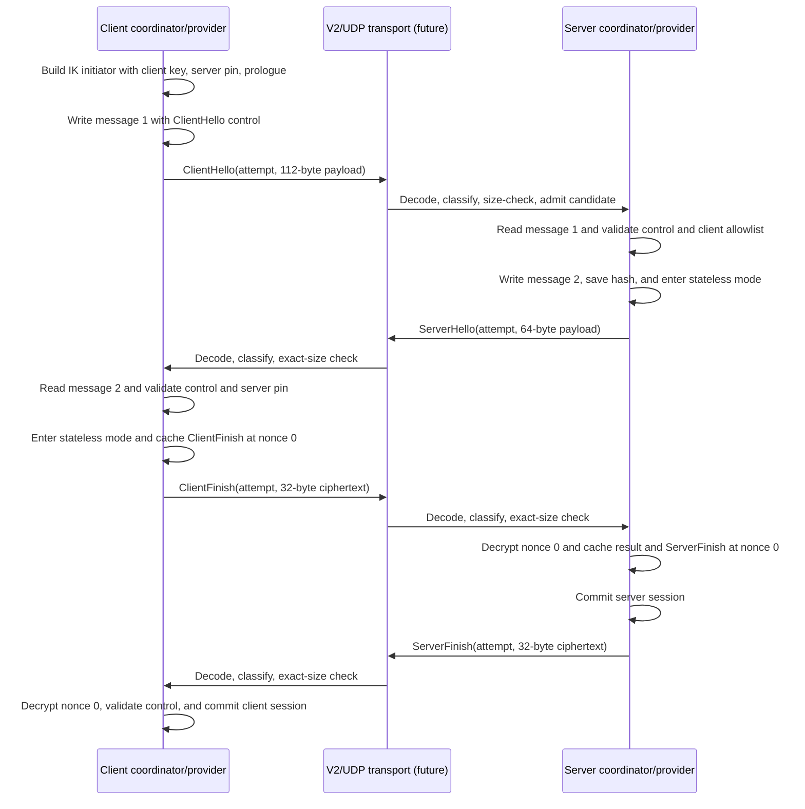

# Noise IK provider design

Status: **design approved in principle; no implementation exists**

This document is the implementation contract for Crabnet's first real authenticated handshake
provider. It selects Noise IK, defines how its two-message handshake fits Crabnet's existing
four-message coordinator, and identifies the work required before the provider reaches UDP.

Nothing here makes the current executable secure. Version 1 remains the only active runtime
protocol, and the fake provider remains test-only.

## Decision summary

Use this fixed profile:

```text
Noise_IK_25519_ChaChaPoly_BLAKE2s
```

The initial Rust implementation candidate is `snow`, using `HandshakeState` during IK and
`StatelessTransportState` afterward. No dependency is added by this design milestone. The exact
crate version and crypto resolver must be reviewed and pinned when implementation begins.

IK fits Crabnet because the client connects to one configured server and can pin its static public
key, both peers can have static X25519 identities, the server can allowlist clients, and the fixed
profile avoids unauthenticated algorithm negotiation. IK requires advance distribution of the
server public key. First-contact discovery, certificates, and transparent server-key rotation are
separate features; Crabnet must not silently fall back to XX or Version 1.

Noise IK is a two-message handshake:

```text
<- s
...
-> e, es, s, ss
<- e, ee, se
```

Crabnet's four messages map to it as follows:

| Crabnet message | Meaning | Opaque payload |
| --- | --- | --- |
| `ClientHello` | Noise IK message 1 | `e, es, s, ss` plus encrypted binding record |
| `ServerHello` | Noise IK message 2 | `e, ee, se` plus encrypted binding record |
| `ClientFinish` | Initiator key confirmation | Noise transport ciphertext at nonce `0` |
| `ServerFinish` | Responder key confirmation | Noise transport ciphertext at nonce `0` |

The finish messages are not extra Noise handshake patterns. They are the first authenticated
transport messages and preserve Crabnet's existing commit boundary.

See the [Noise Protocol Framework](https://noiseprotocol.org/noise.html) and the candidate
[`snow` API](https://docs.rs/snow/latest/snow/). Snow's stateless transport mode accepts explicit
application nonces, which is the appropriate primitive for an unreliable UDP protocol.

## Scope

This milestone designs static-key configuration, peer authentication, domain separation, exact
provider payloads, a real implementation of the existing crypto traits, authenticated session
metadata, duplicate-safe confirmations, cleanup, and pure tests.

It does not design or implement Tokio UDP integration, retry timers, encrypted data frames, data
sequence/replay policy, rekey epochs, roaming, key-generation commands, certificates, multi-client
data routing, or protocol fallback. The provider may produce transport keys, but packet forwarding
must wait for the encrypted-data milestone.

## Wire profile and authenticated binding

### Fixed constants

```text
NOISE_PROTOCOL_NAME = "Noise_IK_25519_ChaChaPoly_BLAKE2s"
CRABNET_NOISE_PROFILE = 1
CONTROL_MAGIC = ASCII "CNIK"
CONTROL_RECORD_LENGTH = 16
AEAD_TAG_LENGTH = 16
X25519_PUBLIC_KEY_LENGTH = 32
```

Both roles construct this profile locally. It is never selected by an inbound datagram.

### Per-attempt prologue

Both roles build the same canonical prologue before creating a Noise state:

```text
ASCII "CRBN-NOISE-IK"
0x00
outer protocol version: u8 = 2
Noise profile: u8 = 1
client attempt ID: u64, network byte order
```

This domain-separates Crabnet, fixes the profile, and binds the public attempt ID into the
handshake hash. Do not bind the UDP source address: source authorization remains session policy,
and cryptographic address binding would preclude a later explicitly designed roaming feature.

### Authenticated control record

Every Noise handshake payload and confirmation plaintext is exactly 16 bytes:

| Offset | Size | Field | Rule |
| ---: | ---: | --- | --- |
| 0 | 4 | Control magic | ASCII `CNIK` |
| 4 | 1 | Profile | `1` |
| 5 | 1 | Message kind | V2 value `2`, `3`, `4`, or `5` |
| 6 | 2 | Reserved | zero |
| 8 | 8 | Client attempt ID | non-zero big-endian value equal to outer frame |

After decryption, the provider compares all fields with local expectations. A mismatch is an
authentication failure even if the AEAD tag passed. Thus message kind and attempt are authenticated,
while the V2 codec independently enforces `CRBN`, Version 2, zero flags, and exact lengths.

### Exact operational sizes

| Message | Calculation | Opaque bytes |
| --- | --- | ---: |
| `ClientHello` | ephemeral `32` + encrypted static `48` + encrypted control `32` | `112` |
| `ServerHello` | ephemeral `32` + encrypted control `32` | `64` |
| `ClientFinish` | control `16` + tag `16` | `32` |
| `ServerFinish` | control `16` + tag `16` | `32` |

Configure `V2HandshakeCodec` with maximum opaque payload `112`. The largest frame is
`10 + 8 + 112 = 130` bytes and the receive buffer is `131` bytes. The adapter also enforces the
exact size for each kind before crypto. Freeze these sizes against the selected library; a mismatch
means the profile assumptions need review, not that constants should be casually changed.

### Identity and session metadata

The 32-byte static X25519 public keys are the first profile's identities. The client compares the
Noise responder key with its pin. The server retrieves the authenticated initiator key from Noise
and requires an exact allowlist match. A UDP address is never a peer identity.

The current `PeerIdentity(u64)` is too small. Replace it with a 32-byte value or a dedicated public
key fingerprint. Both sides also copy the complete 32-byte final Noise handshake hash as the
`SessionId`; replace `SessionId(u64)` rather than truncating it.

Public identities and the handshake hash are non-secret, but logs should use short explicitly
labeled diagnostic fingerprints. Never log private keys, provider payloads, control plaintext, or
transport state.

### Nonces and the future data boundary

Convert the completed handshake into `StatelessTransportState`, not sequential stream-style
`TransportState`:

```text
ClientFinish initiator -> responder nonce = 0
ServerFinish responder -> initiator nonce = 0
first future encrypted data nonce in either direction = 1
```

A retry resends the exact cached confirmation ciphertext. It never encrypts new plaintext with
nonce zero. A later design must add explicit data sequence numbers, a replay window, exhaustion
behavior, and rekey epochs before TUN packets use these keys.

## 1. Component responsibilities

### `NoiseIkProfile`

Owns fixed constants and pure helpers for the protocol name, prologue, control records, exact sizes,
and redacted error mapping. It owns no keys, socket, candidate, deadline, or lifecycle state.

### Static key material and configuration

Load one local 32-byte X25519 private key from a dedicated file, not inline TOML. Reject missing or
invalid files, wrong lengths/encoding, library-rejected keys, and insecurely broad Unix permissions
when detectable. The wrapper must not have revealing `Debug`, `Display`, serialization, or casual
`Clone`; use reviewed zeroization on drop.

Client configuration owns one private-key path and one pinned server public key. Server
configuration owns one private-key path and a non-empty, duplicate-free client-public-key allowlist.
Validation happens before sockets, TUN, routes, or NAT are created.

### `NoiseIkClientProvider`

Implements `ClientHandshakeCrypto` and exclusively owns the current Noise state, attempt ID,
pinned server identity, final handshake hash, stateless transport state, cached exact
`ClientFinish`, cached `ServerFinish` result, lifecycle, and cleanup accounting. It does not own
addresses, deadlines, framing, sockets, or retry scheduling.

### `NoiseIkServerProvider`

Implements `ServerHandshakeCrypto`. It owns one context per trusted coordinator `CandidateId`, the
server static key, allowlist, authenticated client identity, handshake/transport states, handshake
hash, cached duplicate bytes, and one established context. Candidate IDs remain local and are never
read from wire bytes.

### Provider-payload adapter

The adapter decodes and role-classifies V2 first, enforces the message-specific exact size, copies
borrowed ciphertext into a redacted owned type, dispatches to the coordinator, and encodes returned
ciphertext without inspecting it. It is synchronous and never calls the Noise library directly.

### Existing coordinator and session policy

They continue to authorize source, attempt, phase, deadline, and duplicates before crypto; verify
all provider correlations; commit policy and provider state; and fail closed on local errors.

### Future Tokio runtime adapter

This later component owns sockets, deadlines, retransmission, cancellation, and counters. It must
not enable TUN forwarding when Noise message 2 succeeds. Establishment requires both confirmation
messages and coordinator commit.

## 2. Data flow

### Startup

```text
parse configuration
  -> validate secure mode and role-specific fields
  -> load local private key
  -> parse pinned or allowlisted public keys
  -> construct provider
  -> construct V2 codec with maximum opaque payload 112
  -> only then bind runtime resources in a later milestone
```

### Authenticated exchange



An identical duplicate `ClientHello` returns the exact cached `ServerHello` without generating a
new ephemeral key. An identical duplicate `ClientFinish` returns the cached authenticated result
and exact cached `ServerFinish`. Same identifiers with different bytes are conflicting duplicates
and never overwrite cached state.

## 3. Language-neutral pseudocode

### Profile helpers

```text
BUILD_PROLOGUE(attempt):
  require attempt != 0
  return ASCII("CRBN-NOISE-IK") || BYTE(0) || BYTE(2) || BYTE(1) || U64_BE(attempt)

ENCODE_CONTROL(kind, attempt):
  require kind is one of the four V2 handshake kinds
  require attempt != 0
  return ASCII("CNIK") || BYTE(1) || BYTE(WIRE_VALUE(kind)) || U16_BE(0) || U64_BE(attempt)

VALIDATE_CONTROL(plaintext, expected_kind, expected_attempt):
  require length(plaintext) == 16
  require magic == "CNIK", profile == 1, reserved == 0
  require kind == WIRE_VALUE(expected_kind)
  require attempt == expected_attempt
  otherwise return REMOTE_AUTHENTICATION_FAILURE
```

### Client creates `ClientHello`

```text
CLIENT_START_ATTEMPT(attempt):
  require phase == Idle
  handshake = NOISE_BUILDER(fixed_protocol_name)
    .local_private_key(client_static_private)
    .remote_public_key(pinned_server_static_public)
    .prologue(BUILD_PROLOGUE(attempt))
    .build_initiator()

  message_1 = handshake.write_message(ENCODE_CONTROL(ClientHello, attempt))
  require length(message_1) == 112
  save context(attempt, handshake, exact_client_hello=message_1)
  phase = AwaitingServerHello
  return PREPARED_CLIENT_HELLO(attempt, REDACTED_OWNED(message_1))
```

### Server creates `ServerHello`

```text
SERVER_PREPARE_HELLO(candidate, attempt, payload):
  require phase == Running
  if context exists for candidate:
    require context.attempt == attempt
    if payload == context.exact_client_hello:
      return SUCCESS(copy(context.cached_server_hello))
    remove exact context
    return REMOTE_AUTHENTICATION_FAILURE(conflicting_duplicate)

  require length(payload) == 112
  handshake = NOISE_BUILDER(fixed_protocol_name)
    .local_private_key(server_static_private)
    .prologue(BUILD_PROLOGUE(attempt))
    .build_responder()
  plaintext = handshake.read_message(payload)
    on failure: erase temporary state; return REMOTE_AUTHENTICATION_FAILURE
  VALIDATE_CONTROL(plaintext, ClientHello, attempt)
  client_public = handshake.get_remote_static()
  require client_public has 32 bytes and is in allowed_client_public_keys

  message_2 = handshake.write_message(ENCODE_CONTROL(ServerHello, attempt))
  require handshake is finished and length(message_2) == 64
  handshake_hash = copy full handshake hash
  transport = handshake.into_stateless_transport_mode()
  save context(candidate, attempt, client_public, handshake_hash, transport,
               exact_client_hello=payload, cached_server_hello=message_2)
  return SUCCESS(PREPARED_SERVER_HELLO(candidate, attempt, message_2))
```

### Client handles `ServerHello`

```text
CLIENT_AUTHENTICATE_SERVER_HELLO(attempt, payload):
  require phase == AwaitingServerHello and attempt == context.attempt
  require length(payload) == 64
  plaintext = context.handshake.read_message(payload)
    on failure: erase context; return REMOTE_AUTHENTICATION_FAILURE
  VALIDATE_CONTROL(plaintext, ServerHello, attempt)
  require handshake is finished
  require handshake.get_remote_static() == pinned_server_static_public
  handshake_hash = copy full handshake hash
  transport = handshake.into_stateless_transport_mode()
  client_finish = transport.write_message(0, ENCODE_CONTROL(ClientFinish, attempt))
  require length(client_finish) == 32
  save transport, handshake_hash, server identity, cached_client_finish
  phase = AwaitingServerFinish
  return SUCCESS(AUTHENTICATED_SERVER_HELLO(attempt))

CLIENT_PREPARE_FINISH(attempt):
  require phase == AwaitingServerFinish and attempt == context.attempt
  return PREPARED_CLIENT_FINISH(attempt, copy(cached_client_finish))
```

The mutating authentication method creates and caches the ciphertext. Thus the existing
`prepare_client_finish(&self)` method need not mutate a nonce state.

### Server handles `ClientFinish`

```text
SERVER_AUTHENTICATE_CLIENT_FINISH(candidate, attempt, payload):
  context = exact pending or established context
  require context.attempt == attempt and length(payload) == 32
  if context.cached_client_finish exists:
    if payload == context.cached_client_finish:
      return SUCCESS(copy(context.cached_authenticated_result))
    return REMOTE_AUTHENTICATION_FAILURE(conflicting_duplicate)

  plaintext = context.transport.read_message(0, payload)
    on failure: return REMOTE_AUTHENTICATION_FAILURE
  VALIDATE_CONTROL(plaintext, ClientFinish, attempt)
  metadata = { session_id: full handshake_hash,
               peer_identity: authenticated client public key }
  server_finish = context.transport.write_message(0, ENCODE_CONTROL(ServerFinish, attempt))
  require length(server_finish) == 32
  cache exact payload, authenticated result, and exact server_finish
  mark AuthenticatedPendingCommit
  return SUCCESS(AUTHENTICATED_CLIENT_FINISH(candidate, attempt, metadata))

SERVER_COMMIT_SESSION(candidate, attempt, metadata):
  require exact context and metadata
  move it to Established and erase all other candidates

SERVER_PREPARE_FINISH(candidate, attempt, session_id):
  require exact established context and matching session_id
  return PREPARED_SERVER_FINISH(copy(cached_server_finish))
```

Precomputing also preserves `prepare_server_finish(&self)` and makes retries byte-identical.

### Client handles `ServerFinish`

```text
CLIENT_AUTHENTICATE_SERVER_FINISH(attempt, payload):
  require phase == AwaitingServerFinish and attempt == context.attempt
  require length(payload) == 32
  plaintext = context.transport.read_message(0, payload)
    on failure: erase context; return REMOTE_AUTHENTICATION_FAILURE
  VALIDATE_CONTROL(plaintext, ServerFinish, attempt)
  metadata = { session_id: full handshake_hash,
               peer_identity: pinned server public key }
  cache exact payload and authenticated result
  mark AuthenticatedPendingCommit
  return SUCCESS(AUTHENTICATED_SERVER_FINISH(attempt, metadata))

CLIENT_COMMIT_SESSION(attempt, metadata):
  require exact pending context and metadata
  mark Established
```

### Shutdown

```text
PROVIDER_SHUTDOWN():
  if Closed: return idempotent zero-cleanup report
  reject new calls
  erase handshake states, transport states, cached buffers, and owned private-key copies
  clear pending and established contexts
  phase = Closed
  return only non-secret counts and flags
```

## 4. Important states and invariants

### Client provider states

```text
Idle
  -> AwaitingServerHello { HandshakeState, exact ClientHello }
  -> AwaitingServerFinish { StatelessTransportState, handshake hash,
                            server identity, cached ClientFinish }
  -> AuthenticatedPendingCommit { validated ServerFinish }
  -> Established { transport state, metadata }
  -> Closed
```

### Server provider states

```text
Running { zero or more candidate contexts }
  -> candidate AwaitingClientFinish { transport state, handshake hash,
                                      client identity, cached ServerHello }
  -> candidate AuthenticatedPendingCommit { cached ClientFinish and ServerFinish }
  -> Established { exactly one context and no pending candidates }
  -> Closed
```

`AuthenticatedPendingCommit` is transient at the coordinator boundary. No public coordinator method
may return while policy and crypto disagree about establishment.

Required invariants:

1. The protocol name is fixed locally and never negotiated.
2. Client initiation requires a pinned server key; server success requires an allowlisted client.
3. Prologue and authenticated control both bind one non-zero attempt ID.
4. Authenticated control kind equals the V2 outer kind.
5. Candidate IDs remain server-local and are selected only after coordinator policy.
6. No context is selected by unauthenticated provider content.
7. Duplicates reuse identical cached bytes; they never generate a new ephemeral key or encrypt new
   plaintext with nonce zero.
8. Confirmation nonce zero is reserved; future encrypted data starts at one.
9. TUN data cannot move before both confirmations and coordinator commit.
10. Both endpoints commit the same full handshake hash and the opposite authenticated static key.
11. Secrets and payloads never appear in diagnostics.
12. Invalid remote input is a typed rejection; local state/library failure is fatal.
13. Shutdown is terminal, idempotent, and removes every crypto context.
14. Secure V2 and legacy V1 are explicit startup modes; inbound traffic cannot cause downgrade.

## 5. Error and shutdown cases

| Case | Classification | Required result |
| --- | --- | --- |
| Missing/unreadable private-key file | Local startup fatal | Start no provider or runtime resource |
| Invalid key or empty/duplicate allowlist | Local configuration fatal | Reject before bind |
| Noise builder/RNG/primitive failure | Local fatal | Coordinator fail-closed shutdown |
| Wrong kind-specific payload size | Remote drop before Noise | No provider mutation |
| Noise decrypt/tag failure | Expected remote rejection | Remove exact affected context per coordinator |
| Authenticated control mismatch | Expected remote rejection | Never advance phase |
| Unknown authenticated client key | Expected remote rejection | Do not reveal allowlist details |
| Wrong pinned server key | Expected remote rejection | Close client attempt |
| Same IDs with different duplicate bytes | Conflicting duplicate | Never overwrite cache |
| Provider correlation/metadata mismatch | Local invariant violation | Shut policy and provider down |
| Required cache absent | Local provider-state fatal | Fail closed |
| Outbound encode/send failure after advance | Local fatal | Coordinator shutdown exactly once |
| Handshake timeout | Existing policy timeout | Erase exact attempt/candidate context |
| Ctrl+C during handshake | Orderly shutdown | Stop input, coordinator shutdown, OS cleanup |
| Nonce exhaustion | Local fatal | Close before wrap; never reuse a nonce/key pair |
| Data before establishment | Remote drop | No TUN write or peer registration |

Remote responses must be coarse so the server does not reveal whether a client key was unknown, a
tag was wrong, or a control field differed. Preserve the coordinator's primary-error-plus-cleanup
reporting; a cleanup error must not replace the original failure.

## 6. Tests to write

All provider and adapter tests are unprivileged and use no sockets, TUN devices, or namespaces.

### Profile and encoding

- freeze the protocol name, prologue vectors, and all four 16-byte control records;
- reject wrong, truncated, and trailing control fields;
- freeze opaque sizes `112`, `64`, `32`, and `32` against the selected library;
- verify big-endian attempt encoding; and
- prove errors and `Debug` never include provider or secret bytes.

### Real IK success

- use fixed non-production key fixtures or an injected deterministic test resolver;
- run all four messages through both coordinators entirely in memory;
- assert matching full session IDs and opposite static-key identities;
- prove message 1 does not contain the client static public key as a clear substring;
- prove confirmations decrypt only with nonce zero and the correct direction; and
- assert no pending provider context remains after commit.

### Authentication and binding rejection

- wrong server pin and a server private key that does not match the pin;
- valid but non-allowlisted client key;
- bit flip at every byte of every provider message;
- changed outer attempt or kind with unchanged ciphertext;
- mismatched prologue version, profile, or attempt;
- mismatched decrypted control kind or attempt;
- cross-attempt and cross-session replay; and
- reversed initiator/responder roles.

### Duplicate, lifecycle, and cleanup

- identical duplicate hello/finish returns byte-identical cached output;
- conflicting duplicates cannot replace contexts;
- duplicates do not generate another ephemeral or nonce-zero encryption;
- every method rejects every invalid phase;
- candidate removal erases only the exact candidate;
- one expired candidate leaves other candidates intact;
- commit consistently removes other pending candidates;
- shutdown from every phase is terminal and idempotent; and
- injected local failures produce fatal cleanup with no live context.

### V2 adapter and robustness

- exact sizes pass and every other size is rejected before provider dispatch;
- all real payloads round-trip through V2 unchanged;
- malformed or wrong-direction frames never call policy or crypto;
- owned payloads survive UDP receive-buffer reuse;
- encode failure after coordinator advancement shuts down; and
- arbitrary input never panics the record decoder or adapter.

Later runtime tests must cover loss, reordering, bounded retry, cancellation races with paused Tokio
time, replay windows, rekey epochs, path MTU, and privileged proof that TUN traffic cannot move
before authentication.

## 7. Rust concepts and Tokio APIs

Rust implementation concepts:

- associated payload types on the existing client/server crypto traits;
- explicit context enums and exhaustive `match`, rather than loosely related `Option` fields;
- newtypes such as `StaticPublicKey([u8; 32])`, `SessionId([u8; 32])`, and redacted ciphertext;
- `TryFrom<&[u8]>` for exact keys and records;
- `HashMap<CandidateId, PendingNoiseContext>` for bounded server candidates;
- ownership-moving conversion from `HandshakeState` to `StatelessTransportState`;
- fixed arrays or boxed slices for cached exact datagrams;
- a reviewed zeroization wrapper for secrets;
- typed separation of remote authentication failure and local provider failure;
- `anyhow::Context` at key-file/configuration and later I/O boundaries; and
- dependency pinning plus advisory and license review.

Keep `snow` types inside the provider. The immutable `prepare_client_finish(&self)` and
`prepare_server_finish(&self)` methods can remain because the preceding mutating method caches each
ciphertext. If implementation proves that contract unsound, change both traits explicitly; do not
hide nonce mutation behind interior mutability.

Tokio is not needed by the pure provider. Later integration will likely use
`UdpSocket::{recv_from, send_to}`, `tokio::select!`, `tokio::time::{Instant, sleep_until}`, and one
pinned `tokio::signal::ctrl_c` future. Do not hold a mutable coordinator/provider borrow across
`.await`: finish pure processing and materialize owned outbound bytes first. A send failure after
advancement is fail-closed unless an explicit retry design owns the exact cached datagram.

## Configuration direction

The exact Serde representation is not frozen, but it should avoid inline private keys:

```toml
[security]
mode = "noise_ik"
private_key_path = "/etc/crabnet/client.key"
server_public_key = "<canonical encoded 32-byte key>" # client only

# server only
allowed_client_public_keys = ["<canonical encoded 32-byte key>"]
```

Choose one canonical public-key encoding and reject aliases or ambiguous hex/Base64 guessing.
Key generation, rotation, container-secret mounting, and file ownership need a separate
operator-facing design before claiming deployable key management.

## Proposed implementation sequence

1. Freeze keys, session identity, prologue/control helpers, sizes, redacted types, and vectors.
2. Add mode-specific key configuration/loading and validate it before privileged bind.
3. Implement and pure-test the client provider.
4. Implement and pure-test per-candidate server contexts and duplicates.
5. Run real providers through existing coordinators; retain fake providers for fault injection.
6. Add the synchronous provider-payload/V2 adapter.
7. Stop and separately design encrypted data, replay, rekey, and UDP retry before runtime edits.

The provider milestone is complete only when exact profile, binding, and sizes are frozen; both real
providers complete the four-message flow in memory; rejection and cleanup matrices pass; secrets
are redacted and erased; V1 runtime is unchanged; no library type leaks outside the provider; and
the repository's full unprivileged verification gate passes. Privileged namespace testing is not
required until runtime networking behavior changes.
