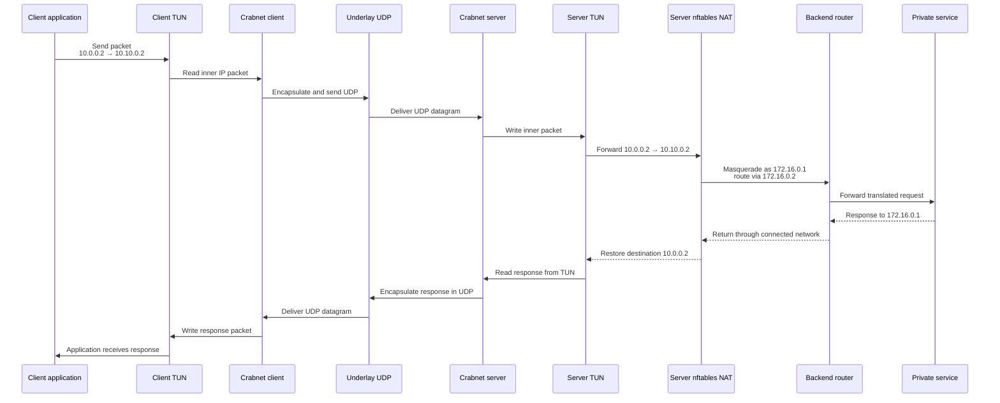
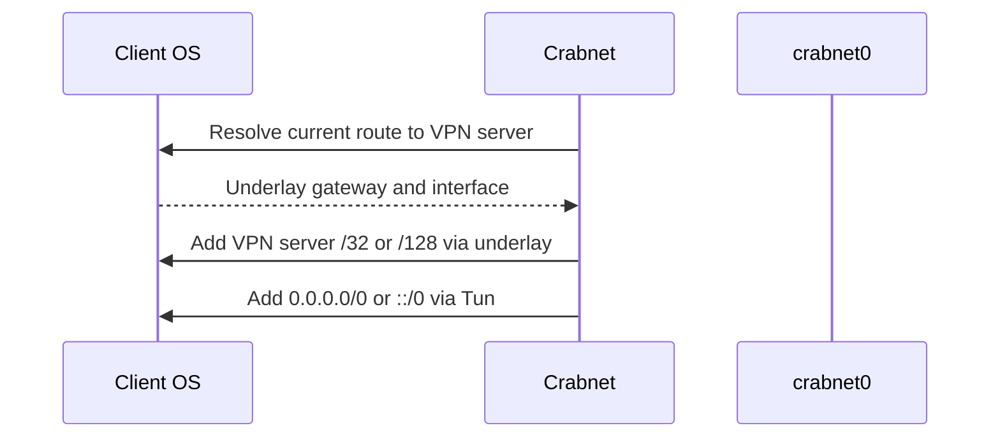
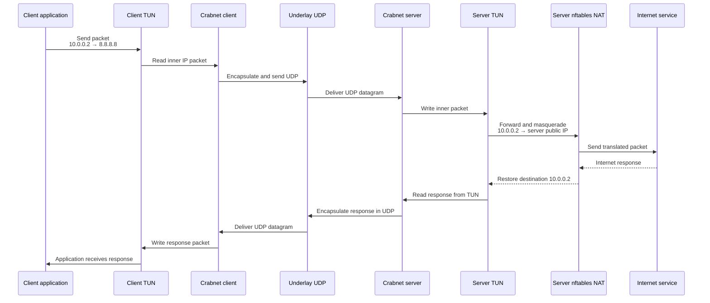

# Routing sequence diagrams

These diagrams show the implemented namespace traffic path and the remaining
internet-facing path. The private-service test covers full-tunnel selection,
server routing, IPv4 forwarding, and source NAT. General internet use remains
future work because firewall policy and full-tunnel DNS are not managed.

The packet-path diagrams show the legacy unauthenticated V1 runtime. Noise-IK is a separate
handshake-only runtime path: it exchanges and authenticates V2 handshake frames, then stops before
TUN creation and packet forwarding. These diagrams must not be read as encrypted tunnels.

## Private service routing

## Global/full-tunnel routing

Startup resolves and protects the transport path before redirecting the
client's remaining traffic:

The lookup must precede the TUN default route; otherwise route resolution could
return `crabnet0` and send the tunnel's own UDP packets back into the tunnel.

The client default route and VPN-server endpoint exclusion are implemented for
the isolated namespace test. Server IPv4 forwarding, masquerading, ownership
checks, and graceful NAT cleanup are also implemented. The remaining global
path requires:

- administrator-managed firewall forwarding policy;
- full-tunnel DNS handling; and
- a reviewed version 2 handshake and encrypted data protocol;
- runtime integration that gates forwarding on established session metadata; and
- authentication, replay protection, and rekeying before use on untrusted networks.
