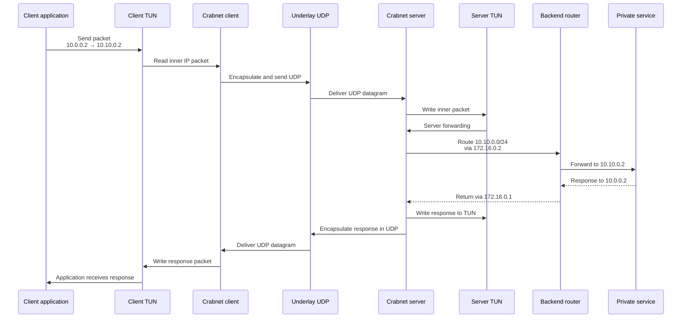
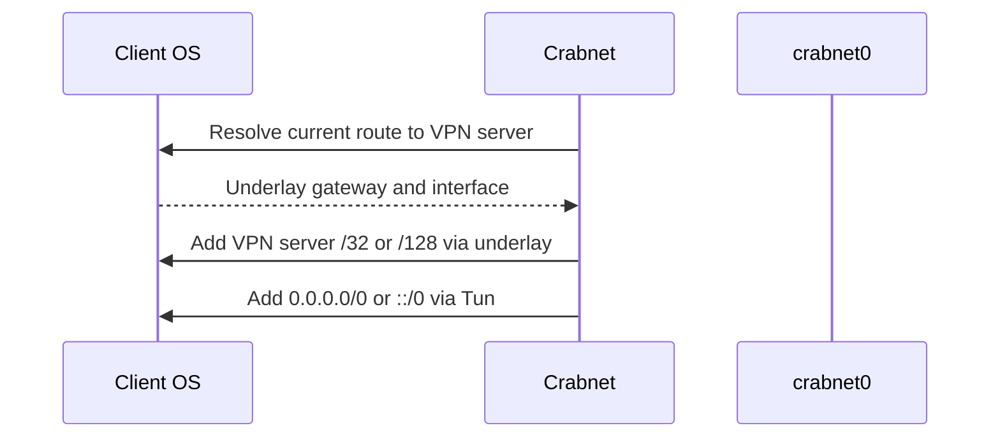
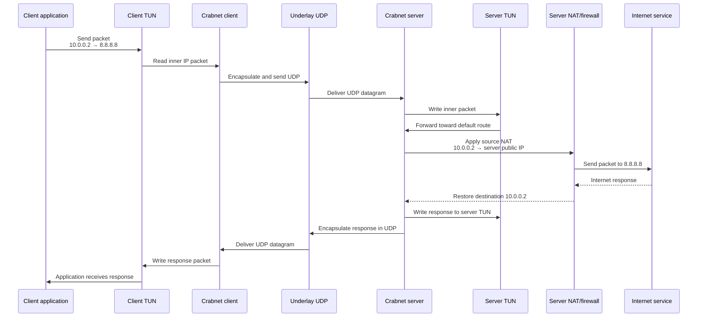

# Routing sequence diagrams

These diagrams show the two intended traffic paths. The private-service path
is covered by the current four-namespace full-tunnel test. Global internet
access is future work because it still requires NAT, firewall rules, and DNS
handling.

## Private service routing

## Global/full-tunnel routing

Startup resolves and protects the transport path before redirecting the
client's remaining traffic:

The lookup must precede the TUN default route; otherwise route resolution could
return `crabnet0` and send the tunnel's own UDP packets back into the tunnel.

The client default route and VPN-server endpoint exclusion are implemented for
the isolated namespace test. The remaining global path requires:

- server NAT/masquerading;
- firewall forwarding rules;
- DNS handling; and
- route and firewall cleanup during shutdown.
